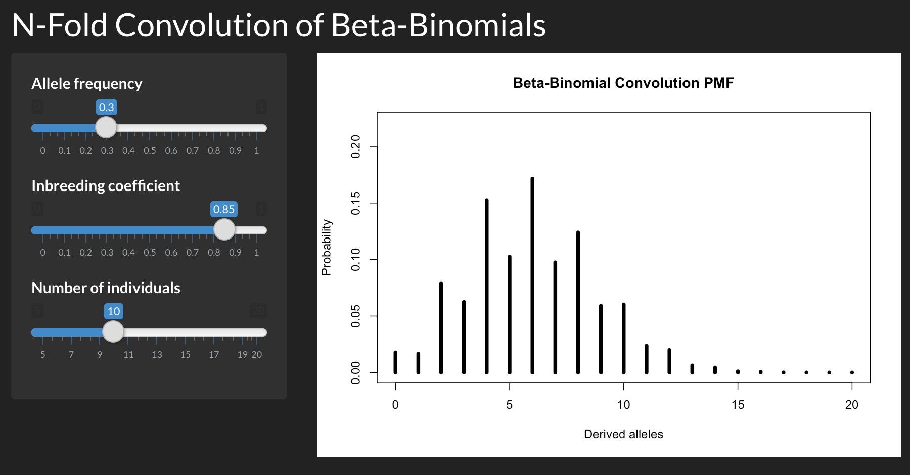

# _N_-Fold Convolution of Beta-Binomials

This folder contains the code needed to visualize the probability mass function
for the _n_-fold convolution of beta-binomial distributions used to derived the expected site frequency spectrum with inbreeding.

```r
# Install these packages if you don't have them
install.packages("shiny")
install.packages("tidyverse")
install.packages("shiny")
```

